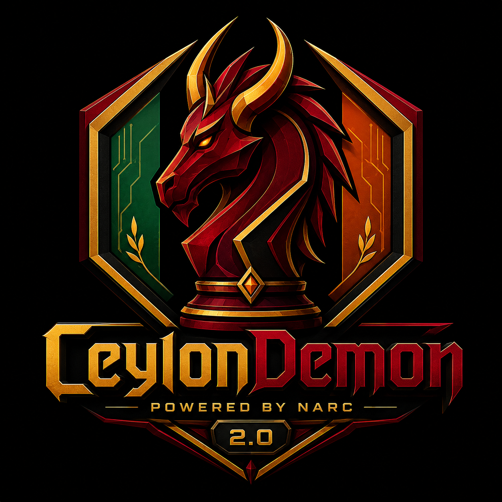

<div align="center">



# CeylonDemon 2.0

**A UCI chess engine whose evaluator reads every position twice — once from each king — and tells you when the two readings disagree.**

*Powered by the NARC Engine.*

[](LICENSE)


[](https://github.com/Madushan996/CeylonDemon2.0/releases)

</div>

---

CeylonDemon is a free, single-file UCI chess engine. The parts that make a chess
engine fast — the board, the move generator, the search — come from the **NARC
Engine**, my own codebase, and they run under GPLv3. What's new here, and the
reason the engine exists, is the evaluator: **Resonance**.

Everything ships in one self-contained executable. The neural network is linked
straight into the binary, so there's no separate file to lose and nothing to
download after you build.

| | |
|---|---|
| **Version** | 2.0 |
| **Author** | Madushan Dissanayake |
| **Protocol** | UCI |
| **Language** | C++20, single translation unit |
| **Platform** | x86-64 |
| **Evaluator** | Resonance v10 — embedded, integer inference |
| **Parallelism** | Lazy SMP, 1–256 threads |
| **Licence** | GNU GPL v3 or later |

## The idea behind Resonance

Most NNUE evaluators look at the board from one point of view: your own king.
Every piece is encoded by where it sits relative to *your* king, which is a
great way to understand your own shelter and structure — and a fairly blind way
to understand the storm building around the *other* king.

Resonance runs two networks side by side instead of one. They're identical
except for which king anchors the frame:

- **AEGIS** looks through your own king. The defensive question: *how safe am I?*
- **LANCE** looks through the enemy king. The offensive question: *how much heat
  is on them?*

A small learned gate blends the two scores per bucket to produce the number the
search uses. But the part I actually care about isn't the blend — it's the gap
between them:

```
sigma = |AEGIS − LANCE|
```

Sigma measures how far the two frames disagree. It is largest in exactly the
positions where a single scalar evaluation is least trustworthy — sharp,
double-edged positions where the defensive and offensive readings genuinely
diverge. The search consumes sigma directly, holding an extra ply of depth in
that high-disagreement tail.

**Under the hood.** Each frame has 7,680 features (10 king buckets × 12 piece
classes × 64 squares) and 320 accumulator lanes per perspective, with 8 output
buckets chosen by piece count. The forward pass is integer end to end — no
floating point anywhere. The network was trained on 73.2 million positions the
engine generated against itself.

> **Network provenance.** The weights embedded in the current release were
> warm-started from a Stockfish teacher network. The engine source contains no
> Stockfish code, but the network carries Stockfish ancestry and is not
> presented as independently derived. A clean-provenance network, trained
> without a Stockfish-derived teacher, is under development; until it ships this
> applies to every released binary, since the network is linked into the
> executable. See [NOTICE.md](NOTICE.md) §4.

## Board and search

Bitboards with magic sliding attacks, 16-bit moves, pseudo-legal generation
behind a king-attack legality test, Zobrist hashing. The search is principal
variation search over a shared transposition table, with the usual modern
machinery: killers, counter-moves, history with gravity, continuation and
capture history, late move reductions, null-move pruning with high-depth
verification, ProbCut, singular extensions, bounded check extensions, reverse
futility, razoring, and a quiescence search. None of these techniques are mine
to claim — they're the shared inheritance of computer chess, and
[NOTICE.md](NOTICE.md) credits them properly.

Move generation is checked against the published perft references:

| Position | Depth | Nodes |
|---|---|---|
| Start position | 5 | 4,865,609 |
| "Kiwipete" | 4 | 4,085,603 |

## Originality

Original to this project:

- ✅ **Dual-frame architecture (AEGIS / LANCE)** — two feature transformers
  differing only in which king anchors the frame
- ✅ **Four accumulator slices** — `{AEGIS, LANCE} × {white, black}`, where a
  conventional NNUE keeps two
- ✅ **Learned per-bucket blend gate** —
  `eval = (gate × AEGIS + (256 − gate) × LANCE) / 256`
- ✅ **Sigma** — `|AEGIS − LANCE|`, an uncertainty estimate that falls out of the
  architecture itself, with no second network and no additional forward pass
- ✅ **Sigma-driven reduction control** — the search softens late move reductions
  in the high-disagreement tail
- ✅ **Four-slice incremental update rule** — a king move refreshes only the two
  slices that king anchors, and only when the bucket or mirror side changes
- ✅ **The `.aa` network format**, its loader, and the embedded-network build
- ✅ **The SIMD kernels** in `resonance_simd.h`
- ✅ **The training corpus** — 73.2 million self-play positions generated by the
  engine itself

**Not claimed.** NNUE itself (Yu Nasu, 2018); the quantisation and inference
scheme, which follows Stockfish; the search techniques listed above, all of
which are long published; and the current network weights, which were
warm-started from a Stockfish teacher. [NOTICE.md](NOTICE.md) records each of
these in full.

These are claims of authorship rather than of priority. The work above is
original to CeylonDemon, which is not the same as being first to it.

## Building

You'll need GCC 12 or newer (MSYS2 UCRT64 on Windows). The network links into
the executable, so what comes out is one portable file.

```bash
make                    # x86-64-avx2, the portable default
make ARCH=x86-64-bmi2   # Skylake and later, fast PEXT
make ARCH=native        # tuned to the machine you're on
```

On Windows, `.\build.ps1` does the same thing and also links the version
resource.

## UCI options

| Option | Default | Meaning |
|---|---|---|
| `Hash` | 128 | Transposition table size, MB |
| `Threads` | 1 | Search threads |
| `Move Overhead` | 30 | Milliseconds held back for GUI/network latency |
| `EvalFile` | `<embedded>` | Load an external `.aa` network instead of the built-in one |

There's also a non-UCI `eval` command: it prints the blended score and sigma
for the current position, and checks the incremental accumulator against a full
refresh so you can see the two agree.

## How strong is it?

**2719.5 ± 32.8** — a locally transferred CCI-STC estimate under 10+0.1
conditions.

This is **not** an official CCI rating and **not** universal Elo. It is an
interpolation against a fixed set of anchor engines, reported below with its
limitations.

| | |
|---|---|
| Games | 320, every one completed — no stalls, crashes, or forfeits |
| Record | 39–82–199 (80.0 / 320, 25.0%) |
| Conditions | 10+0.1 s, 1 thread, 64 MB hash, UHO openings, no adjudication |
| Opponents | 8 anchors from 2761 (Monolith 3.0) up to 3101 (Rose 1.0.0) |
| Tools | FastChess 1.8.2-alpha, Ordo 1.2.6 (`-F 95`, 10,000 simulations) |
| Hardware | Intel Core i7-6600U @ 2.60 GHz, 2C/4T |

The engine lands *inside* the anchor range rather than below it — it outscores
Monolith 3.0 at 43.8% and loses to everything above — so the rating is an
interpolation, not an extrapolation off the end of the field. Seven of the eight
per-opponent residuals sit between −0.6 and +3.5 points, which is a tight fit.
The odd one out is **Rose 1.0.0**: 0.5/40 where the rating predicts about 4.0/40.
That's a real outlier, outside sampling noise, and I don't yet know why.

**Caveats.** The ±32.8 is statistical error only; the error introduced by
transferring against these particular anchors is systematic and unquantified.
The run says nothing about other time controls, thread counts, or hash sizes,
and version gaps under roughly 65 Elo are unresolvable at this precision.
CeylonDemon has never played a game under CCRL conditions and does not appear on
any public rating list. Independent testing is welcome.

## Credits and licence

CeylonDemon is built on the **NARC Engine**, my own codebase, used under GPLv3.

Like every modern engine, it implements widely published search ideas it didn't
invent — PVS, null-move pruning, late move reductions, ProbCut, singular
extensions and the rest — and its NNUE quantisation follows the architecture
published by the Stockfish project. [NOTICE.md](NOTICE.md) sets out every one of
those debts in full, along with the engine's lineage and the network's
provenance.

**AI assistance.** Parts of this project were developed with OpenAI Codex in
Visual Studio Code. Design decisions and review are the author's, and the perft
and strength figures above come from measurement rather than from a tool's
output. See [NOTICE.md](NOTICE.md) §6.

CeylonDemon is free software under the **GNU General Public License v3 or
later**. See [LICENSE](LICENSE).

Copyright © 2026 Madushan Dissanayake.
